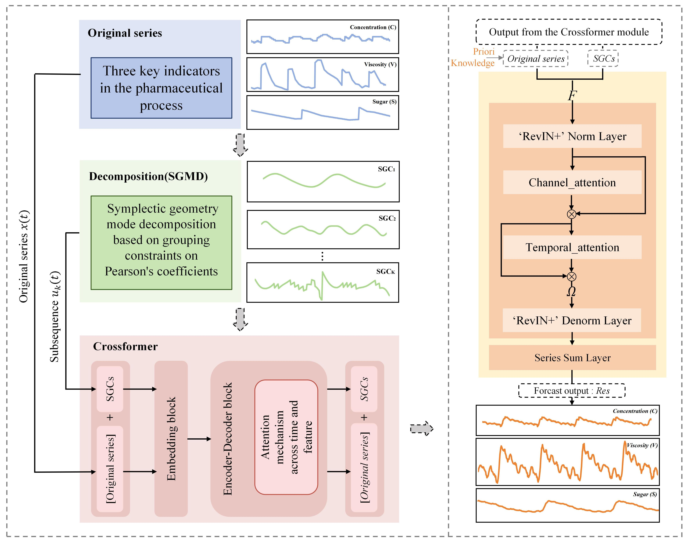

# A Soft Sensor Net based on the Symplectic decomposition-Global attention reconstruction Architecture for Biopharmaceutical Industry

An open-source repository including the BPSN model and other baselines for soft sensing key indicators in fermentation processes.

## Model

<p align="center">
  
</p>

## Usage

1. **Install Python 3.8**. For convenience, execute the following command:

    ```bash
    pip install -r requirements.txt
    ```

2. **Decompose Data.**  
   The decomposition code is under the folder `./decompose/`. After running, you will obtain many SGCs.

3. **Train and evaluate model.**  
   Experiment scripts for all benchmarks are provided under the folder `./scripts/`.  
   You can implement univariate prediction based on raw data for a priori knowledge and multivariate sub-sequences prediction based on SGCs.

4. **Series reconstruction.**  
   The reconstruction codes for different scenarios are under the folder `./restructure/`.

5. **Develop your own model:**

    - Add the model file to the folder `./models`. You can follow the example `./models/Transformer.py`.
    - Include the newly added model in the `Exp_Basic.model_dict` of `./exp/exp_basic.py`.
    - Create the corresponding scripts under the folder `./scripts/`.


